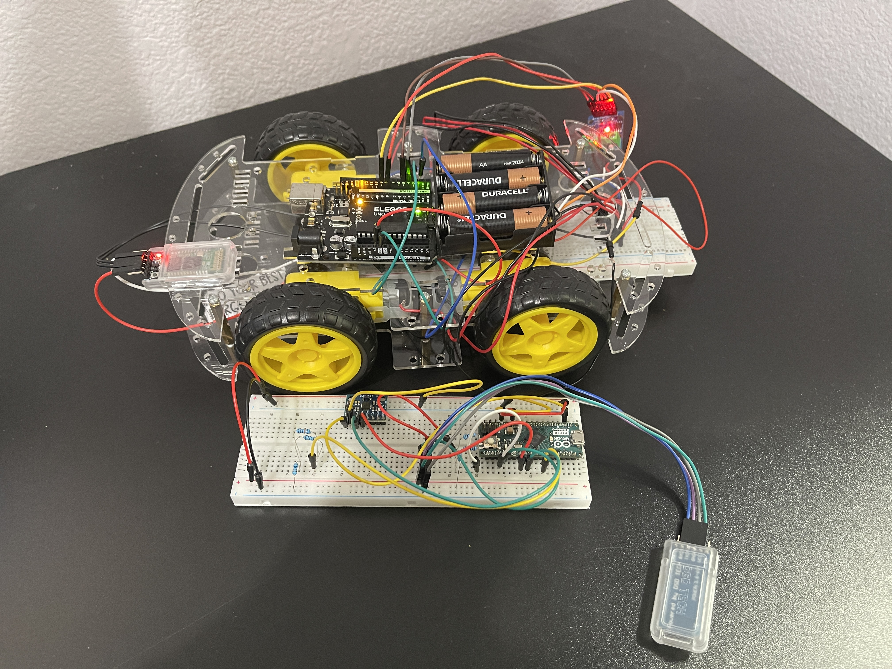
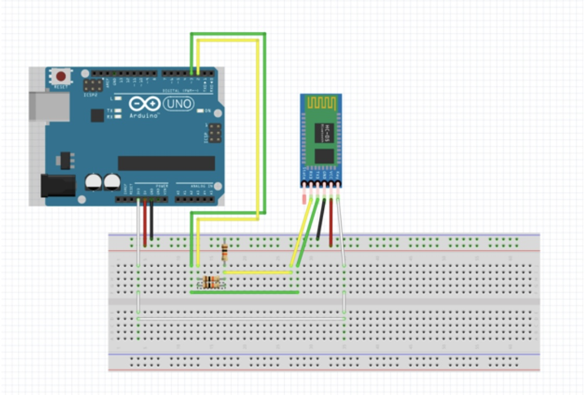
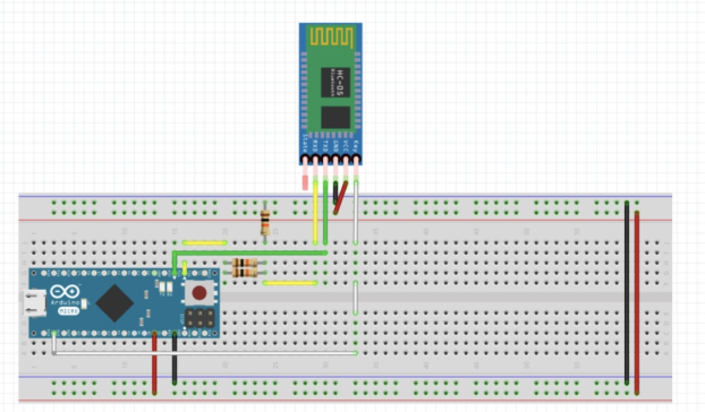
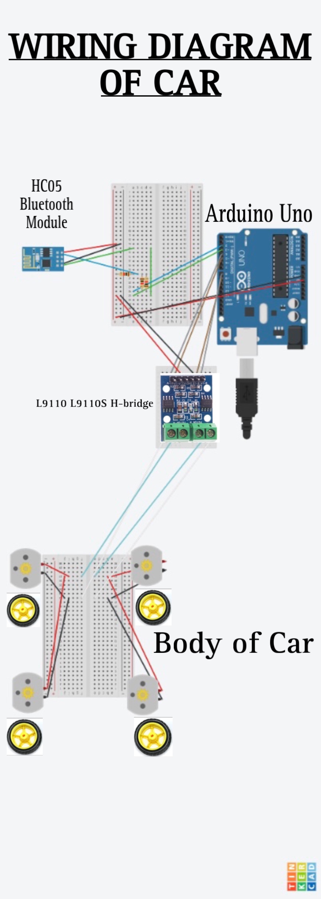

# Vihari's Gesture Controlled Car Portfolio
My project is a Gesture Controlled Car. This is essentially a remote control car, but instead of being controlled by a pair of joysticks, it is controlled with the movements of my hand. This is done with the use of something that many of us use everyday: bluetooth.


| **Engineer** | **School** | **Area of Interest** | **Grade** |
|:--:|:--:|:--:|:--:|
| Vihari T | Dougherty Valley High School | Electrical Engineering | Senior



  
# First Milestone

**The journey of building this gesture-controlled car started with the foundational task of pairing two Bluetooth modules, based on the Arduino UNO and Arduino Micro boards, allowing the controller and car to communicate.**

<iframe width="560" height="315" src="https://www.youtube.com/embed/il1ZObM5pz0" title="YouTube video player" frameborder="0" allow="accelerometer; autoplay; clipboard-write; encrypted-media; gyroscope; picture-in-picture; web-share" referrerpolicy="strict-origin-when-cross-origin" allowfullscreen></iframe>


-The first step was to set up the wiring according to the wiring diagram. My confusion between wires of similar colors as well as my limited knowledge on the workings of the breadboard made this a challenging first step. Through a great attention to detail as well as trial and error, I was able to learn the breadboad layout and correct wiring patterns. This step helped me understand the electric connections on the breadboard worked.

-The second step was to upload the code to the modules, so they would actually do what I wanted them to do. After some dilligent study of the Arduino language references, I was able to bridge the gap between my limited understanding of this C based language and the guiding template I found. This step helped me understand the connection between the logic of the code and the physical indications I was expecting to see in the hardware.

-The third step, my most challenging step, felt more like a leap than a step. It involved actually pairing the two Bluetooth modules. To do this I had to use a series of AT commands to configure one module into the master configuration and the other into the slave configuration. Through careful debugging, cross-checking my commands, and even resetting the firmware I was able to succeed in establishing a working Bluetooth connection.

-The fourth step was wiring an accelerometer onto the Arduino Micro so the tilt of the controller could be sensed and transmitted to the Arduino UNO. Using a number of if-statements, I was able to map the tilt readings from the accelerometer to specific directional commands: Forward, Backwards, Right, Left, and Stop. These were saved as single letters and were then sent to the Arduino UNO.

-In accomplishing this first milestone, I was able to gain valuale hands-on experience involving wiring, troubleshooting, and coding. This milestone set the stage for the further development of my gesture-controlled car.

# Wiring for Bluetooth Modules
Arduino Uno Wiring:


Arduino Micro Wiring:



# Second Milestone

**After pairing the two Bluetooth modules, the next step was to engineer the car's tires so that they rotated in the desired direction in response to specific commands. This began with understanding the workings of the motor control, the power supply, and synchronization of the tires.**

<iframe width="560" height="315" src="https://www.youtube.com/embed/GcUOALzKLXU" title="YouTube video player" frameborder="0" allow="accelerometer; autoplay; clipboard-write; encrypted-media; gyroscope; picture-in-picture; web-share" referrerpolicy="strict-origin-when-cross-origin" allowfullscreen></iframe>


-The first step was to understand the workings of the h-bridge, a circuit that controls the direction and speed of a DC motor. The car's four wheels were controlled by two h-bridges, one for the right 2 wheels and another for the left 2 wheels. Initially, I faced issues trying to synchronize the left two wheels and the right two wheels, which needed to rotate in unision for smooth and coordinated movement.

-To acheive synchronization, I extended the connections of the h-bridge to a larger breadboard. I then wired the wires in a way that the right two wheels would receive the same commands and the left two wheels would receive the same commands. This ensured synchronized and coordinated movement. For example when the car was turning left, the right side wheels needed to rotate forward while the left side wheels needed to rotate backwards. This was an issue that I was able to solve through adjusting the coding through trial and error. 

-After one problem I was faced with another: not all 4 motors were rotating for some of the commands. My first hypothesis was that the motors were faulty. This proved wrong when the issue persisted even after I replaced the motors. My second hypothesis was that the H-bridge might be inefficient at relaying the power from the Arduino UNO to the motors, but replacing the H-bridge didn't resolve the problem. My third hypothesis was that the battery I was using wasn't able to power the Arduino UNO, the H-bridge, the motors, and the bluetooth module all at once. I tried replacing it with a different 9V battery, even a different brand one, yet they did not resolve the issue. Finally, I connected a case of 4 AA batteries to a breadboard and connected the H-bridge and Arduino Uno to the breadboard instead of to each other. This solution worked, and the motors responded to all the commands as I intended them to.

-Finally, I used a series of if-statements to program the Arduino UNO to interpret the single-letter commands (f, b, r, l, and s) transmitted by the Arduino Micro. It would then rotate the motors according to these commands.

-Overcoming these challenges through intuitive thinking and creativity was vital to the development of my car. Eachh step provided a valuable lesson in hardware design, problem-solving, and working with complex electrical components. I now had a working gesture controlled car that was both innovative and efficient.


# Future Aspirations

**Next, I wanted to construct a robotic arm on top of this car. I was going to make that gesture controlled as well using a similar working to that of the car and controller.**

<iframe width="560" height="315" src="https://www.youtube.com/embed/4Xq_3TuRaPQ?si=Hy1Auj6PlfsMPTbg" title="YouTube video player" frameborder="0" allow="accelerometer; autoplay; clipboard-write; encrypted-media; gyroscope; picture-in-picture; web-share" referrerpolicy="strict-origin-when-cross-origin" allowfullscreen></iframe>


-The first step towards this modification was to construct the robotic arm itself. This part was straightforward as it involved the same kind of wiring and coding as the set up of the car——something I had already mastered. This arm's design involved multiple servo motors which allowed the performance of accurate and precise movements.

-The main difficulty I faced after this was switching the microcontroller board of the robotic arm from the Arduino Nano to the Arduino UNO. My plan was to replace the left command for the car with a command that moved the robotic arm; to turn left, I would just rotate the car 270 degrees to the right. This way, when I tilted my controller left, the robotic arm would perform the desired action. However, mapping the equivalent connections on the Arduino UNO proved very difficult. Despite this, I continue to refine my skills and am steadfastly determined to complete this modification.


# Schematics 



# Arduino Uno Code
This is the code that I uploaded to my Arduino Uno, which was connected to the actual car.

```c++
#include <SoftwareSerial.h>

#define tx 2
#define rx 3


SoftwareSerial configBt(rx, tx);
long tm,t,d;

char c="";

const int TWOA1A = 4;
const int TWOA1B = 5;
//left side;
const int TWOB1A = 9;
const int TWOB1B = 8;
//right side;


void setup() {
  Serial.begin(38400);
  configBt.begin(38400);
  pinMode(tx, OUTPUT);
  pinMode(rx, INPUT);

  pinMode(TWOB1A,OUTPUT);
  pinMode(TWOB1B,OUTPUT);

  pinMode(TWOA1A,OUTPUT);
  pinMode(TWOA1B,OUTPUT);

}

void loop() {
  if(configBt.available()){
    c=(char)configBt.read();
    Serial.println(c);
  }

  switch(c){
    case 'f':
      forward();
      break;

    case 'b':
      back();
      break;

    case 'r':
      right();
      break;

    case 'l':
      left();
      break;

    case 's':
      stop();
      break;
  }
}


void forward(){
  digitalWrite(TWOA1A,LOW);
  digitalWrite(TWOA1B,HIGH);
  digitalWrite(TWOB1A,HIGH);
  digitalWrite(TWOB1B,LOW);
}

void back(){
  digitalWrite(TWOA1A,HIGH);
  digitalWrite(TWOA1B,LOW);
  digitalWrite(TWOB1A,LOW);
  digitalWrite(TWOB1B,HIGH);
}

void right(){
  digitalWrite(TWOA1A,HIGH);
  digitalWrite(TWOA1B,LOW);
  digitalWrite(TWOB1A,HIGH);
  digitalWrite(TWOB1B,LOW);
}

void left(){
  digitalWrite(TWOA1A,LOW);
  digitalWrite(TWOA1B,HIGH);
  digitalWrite(TWOB1A,LOW);
  digitalWrite(TWOB1B,HIGH);
}

void stop(){
  digitalWrite(TWOA1A,LOW);
  digitalWrite(TWOA1B,LOW);
  digitalWrite(TWOB1A,LOW);
  digitalWrite(TWOB1B,LOW);
}


```
# Arduino Micro Code
This was my code for the Arduino Micro which was connected to the controller of the car.
```c++
#include <Wire.h>

#define MPU6050_ADDRESS 0x68

int16_t accelerometerX, accelerometerY, accelerometerZ;

void setup()
{
  Wire.begin();
  Serial1.begin(38400);

  Wire.beginTransmission(MPU6050_ADDRESS);
  Wire.write(0x6B);
  Wire.write(0);
  Wire.endTransmission(true);
  delay(100);
}

void loop()
{
  readData();
  doMovement();
  delay(500);
}

void readData()
{
  Wire.beginTransmission(MPU6050_ADDRESS);
  Wire.write(0x3B);
  Wire.endTransmission(false);
  Wire.requestFrom(MPU6050_ADDRESS, 6, true); 

  accelerometerX = Wire.read() << 8 | Wire.read();
  accelerometerY = Wire.read() << 8 | Wire.read();
  accelerometerZ = Wire.read() << 8 | Wire.read();
}


void doMovement()
{
  if (accelerometerY >= 6500) {
    Serial1.write('f');
  }
  else if (accelerometerY <= -4000) {
    Serial1.write('b');
  }
  else if (accelerometerX <= -3250) {
    Serial1.write('l');
  }
  else if (accelerometerX >= 3250) {
    Serial1.write('r');
  }
  else {
    Serial1.write('s');
  }
}

```
# Bill of Materials

| **Part** | **Use** | **Price** | **Link** |
|:--:|:--:|:--:|:--:|
| Screwdriver Set | To tighten screw | $6.99 | <a href="https://www.amazon.com/Arduino-A000066-ARDUINO-UNO-R3/dp/B008GRTSV6(https://www.amazon.com/Small-Screwdriver-Set-Mini-Magnetic/dp/B08RYXKJW9/)/"> Link </a> |
| H-Bridge | To control the motors | $5.99 | <a href="https://www.amazon.com/Ferwooh-Stepper-Controller-2-5-12V-H-Bridge/dp/B0D17PJ2MS/ref=sr_1_1crid=2OQ7UJ1VJLUHU&dib=eyJ2IjoiMSJ9.xPgxMG6cmxZRuRbSqT3QxSr9zBhiCzp3WpnCeGbZjJfW2wU1eHonQ9Yw7yZi2k6Q3PhHd4uR1wLLWBETfHe0SF_wYRGvOug585fW0fsZTX6ImNTMLCJR3VH7MrRlnR7uQ5g0XrAXnzyVOSTEAmuNKyuiUk_vhsIuCNv1HCMrPUyPtn7qKFCwz7vVMcvEXx5Ddy4TPQJlpbS_voU9at8F85yJM5O9Hp5bbg_xuIHUsuE2ePCbv4lATgHmgHzENtlSRiU4laurwSqTAEgEnv9gNIbmb5d2HT5qBLfNChqSyio.9Fh1mUFHx48E8QZCOAX5T2ZJxzbHHdu93PJ63MLUqpM&dib_tag=se&keywords=L9110S+DC&s=electronics&sprefix=l9110s+dc%2Celectronics%2C89&sr=1-1)"> Link </a> |
| Arduino UNO | A microcontroller board used to control the car | $16.99 | <a href="https://www.amazon.com/ELEGOO-Board-ATmega328P-ATMEGA16U2-Compliant/dp/B01EWOE0UU/ref=sr_1_2_sspa?crid=3A6NCD2X9JEMJ&dib=eyJ2IjoiMSJ9.AcWZy-Yg4mDTnhzEHozxzPZdVC5-KUL2tW-OQewDKpBB4brSpDp4bn74WcXiW3KarYertgpNaLJ0VHKx0qsPqolKAhiz1GRG5BwJQl73cEvrlXIXNmqlpSvU7uu2aRVSwAZi9Gj2AjSPLM3esW1Gzy9xEiQ9oiR5LCNjh4MlYDx5mTm5sI4rsD4CFTipJnF572qXlickl35FRcCj8oMXQotumgqI4yEIq0HobOtIlEnNhtVB51JMBHhqtmmF_PC9WeHJ4ySUVVcv_gq3_VeG1aAEbdm4NXmmT6NOYPw4Qo.1PFdgFT22oqO5Mg6-6j_aUL_EV8tUPuaFrB5N9oaEX0&dib_tag=se&keywords=elegoo+arduino&s=electronics&sprefix=elegoo+arduino%2Celectronics%2C99&sr=1-2-spons&sp_csd=d2lkZ2V0TmFtZT1zcF9hdGY&psc=1"> Link </a> |
|8 piece DC Motor| These rotate the tires on the car | $10.99 | <a href="https://www.amazon.com/AEDIKO-Motor-Gearbox-200RPM-Ratio/dp/B09N6NXP4H/ref=sr_1_4?crid=1JP29NIWBLH2M&dib=eyJ2IjoiMSJ9.Wq3jKgOLbqtEP772vMD4pV5f-w3PLBdEpKqguykXOb0JFO14f4Dq0m_VDVUMUFtR8WFINUEticI3GXcoGqwXPqK9yIh04PhCktgccMz9zAUiKXMJPwmOTUp_6av3XuFD0lXo9WngN9iKI6YgZrhEEs9qnqbcB1GnvgntCdKz8Q1dFuNu61NgSE6Z8vBk3FRpaNcr1lCI7FApTiNi0Qce8gbfmMn6oUggZQHpIOKKZ6s.M7WsZ_ZZtm3rm93kKgw0NOxt1McVBYX6m55oGxu1xxI&dib_tag=se&keywords=dc+motor+with+gearbox&sprefix=dc+motor+with+gearbox%2Caps%2C126&sr=8-4)"> Link </a> |
| Electronics Component Kit| Contains the wires and resistors I used | $13.99 | <a href="https://www.amazon.com/Small-Screwdriver-Set-Mini-Magnetic/dp/B08RYXKJW9/)/(https://www.amazon.com/Smraza-Electronics-Potentiometer-tie-Points-Breadboard/dp/B0B62RL725/ref=sxts_b2b_sx_reorder_acb_businesscrid=2IC3T44H3U3WG&cv_ct_cx=breadboard+kit&dib=eyJ2IjoiMSJ9.TUd5tu2T8rmms7ZuJ0UzmbtpLL1zsu93bQM0PzwnP4E.sT0V0vL_QtbYv8ymVTCcRkhFNgBtRvRiT7G4FT1oGTE&dib_tag=se&keywords=breadboard+kit&sbo=RZvfv%2F%2FHxDF%2BO5021pAnSA%3D%3D&sprefix=breadboard+kit%2Caps%2C109&sr=1-2-9f062ed5-8905-4cb9-ad7c-6ce62808241a"> Link </a> |
| 4PC Breadboard Kit | Made all the electronic connections and extended the h-bridge | $8.88 | <a href="https://www.amazon.com/Breadboards-Solderless-Breadboard-Distribution-Connecting/dp/B07DL13RZH/ref=sxts_b2b_sx_reorder_acb_business?crid=1RAL6PA1TZ81Q&cv_ct_cx=breadboard+kit&dib=eyJ2IjoiMSJ9.TUd5tu2T8rmms7ZuJ0UzmbtpLL1zsu93bQM0PzwnP4E.sT0V0vL_QtbYv8ymVTCcRkhFNgBtRvRiT7G4FT1oGTE&dib_tag=se&keywords=breadboard+kit&s=electronics&sbo=RZvfv%2F%2FHxDF%2BO5021pAnSA%3D%3D&sprefix=breadboard+kit%2Celectronics%2C102&sr=1-1-9f062ed5-8905-4cb9-ad7c-6ce62808241a)"> Link </a> |
| Arduino Micro | Controls the controller of the car| $22.48 | <a href="https://www.amazon.com/Arduino-Micro-Headers-A000053-Controller/dp/B00AFY2S56/ref=sxts_b2b_sx_reorder_acb_business?cv_ct_cx=arduino%2Bmicro&keywords=arduino%2Bmicro&sbo=RZvfv%2F%2FHxDF%2BO5021pAnSA%3D%3D&sr=1-1-62d64017-76a9-4f2a-8002-d7ec97456eea&th=1)"> Link </a>|
| Micro USB Cable | Used to upload the code to the Arduino Micro | $5.49 | <a href="https://www.amazon.com/Charging-Transfer-Android-Trustable-MYFON/dp/B098DW7485/ref=sr_1_6?crid=3USJU0DMSZB2S&keywords=micro%2Busb&s=electronics&sprefix=micro%2Busb%2Celectronics%2C106&sr=1-6&th=1"> Link </a>|
| Accelerometer | This sensed the gestures of my hand and outputted it as data | $9.90 | <a href="https://www.amazon.com/Pre-Soldered-Accelerometer-Raspberry-Compatible-Arduino/dp/B0BMY15TC4/ref=sr_1_5?crid=8EDYBVQQY7E2&dib=eyJ2IjoiMSJ9.ID40hq0zMYWtG7Um61yZ63xnujgA2opJZN4n7Ear4a7PVz0kChoZQvMielgIQHXUTy4_yuQvwgK7S5aC7H8U6s5ChRMOd0Iba7IZDg_ySpKnO5uemH-09l_GS1vcaiACgMnHA4JltsdzdfsSBwKgUFAhFhLuvIKnY6G3lrVGfynAdqGHpq4kg53C83MmKTRP8583zcZvMNE8N9pGZr9m2_ctic429UEwmpvof0hrhug.bBXCol9-0Y3cd8LQBcW01jRrDORIYOXF6HAJOn6LUjY&dib_tag=se&keywords=accelerometer+arduino&sprefix=accelerometer+arduino%2Caps%2C110&sr=8-5)"> Link </a> |
| HC05 Bluetooth Device | Sends the signal from the controller to the car as well as receives the signal from the car | $9.99 | <a href="https://www.amazon.com/DSD-TECH-HC-05-Pass-through-Communication/dp/B01G9KSAF6/ref=sr_1_3?crid=2J833J7AYQJA&keywords=hc05&sprefix=hc0%2Caps%2C112&sr=8-3"> Link </a> |
| Solderless Bread | I used the 9V Battery clip to harness the power of the 9V batteries| $7.99 | <a href="https://www.amazon.com/ALAMSCN-Solderless-Breadboard-Battery-Arduino/dp/B08JYPMCZY/ref=sxts_b2b_sx_reorder_acb_business?crid=Z2S8NZU0KN1S&cv_ct_cx=breadboard%2Bpower%2Bsupply&dib=eyJ2IjoiMSJ9.nJ_euybTOUu9E6yyDpnEqg.NgztCYPGkG96eXyyFxpvxOVw5ykdTUq6oziUQnvf51E&dib_tag=se&keywords=breadboard%2Bpower%2Bsupply&s=electronics&sbo=RZvfv%2F%2FHxDF%2BO5021pAnSA%3D%3D&sprefix=breadboard%2Bpower%2Bs%2Celectronics%2C114&sr=1-1-9f062ed5-8905-4cb9-ad7c-6ce62808241a&th=1"> Link </a> |
| 9V Batteries|I used this to power the car| $15.99 | <a href="https://www.amazon.com/Energizer-9V-Alkaline-Batteries-Count/dp/B00COWISBA/ref=asc_df_B00COWISBA/?hvpos=&hvpone=&hvptwo=&hvdvcmdl=&hvlocint=&psc=1&mcid=42efd40966933f1fa468967a05a2c9a3&hvocijid=14602693892681861315-B00COWISBA-&hvexpln=73"> Link </a> |

# Resources that I used
These are some of the resources I used to help me build my car:
- [Gesture Controlled Robotic Arm by Joel A.](https://jabraham777.github.io/Gesture_Controlled_Robotic_Car/)
- [Gesture Controlled Robot via Bluetooth](https://www.hackster.io/embeddedlab786/hand-gesture-control-robot-via-bluetooth-94b13d)
- [A document which helped me establish the Bluetooth connections](https://docs.google.com/document/d/1kMBRRsgoc-byQzOzSLsk8pSVuucN0gmi/edit?usp=sharing&ouid=112686482319576913944&rtpof=true&sd=true)

